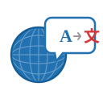
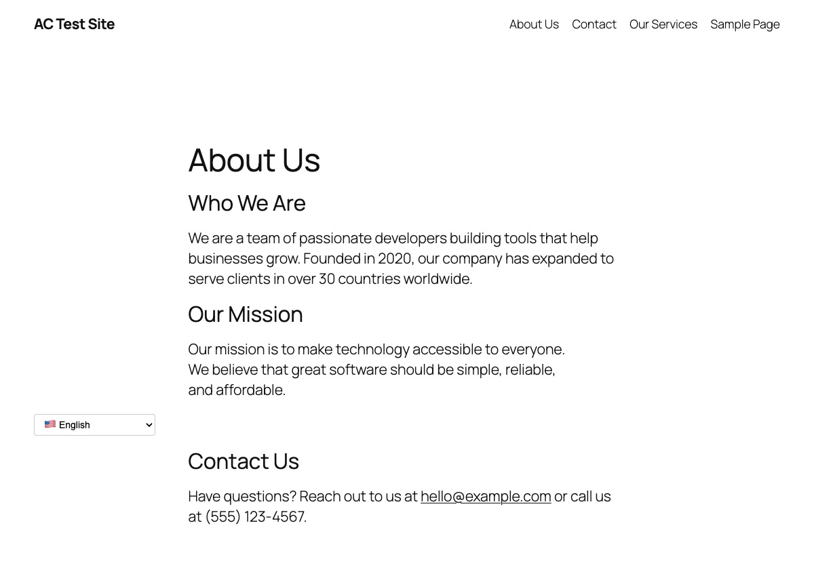
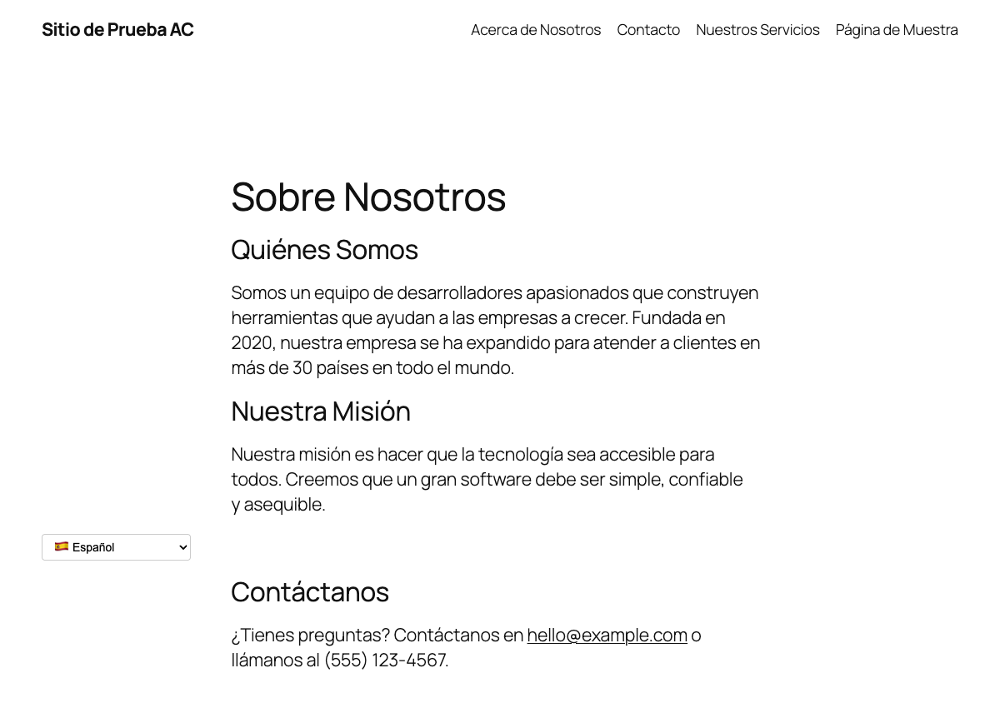
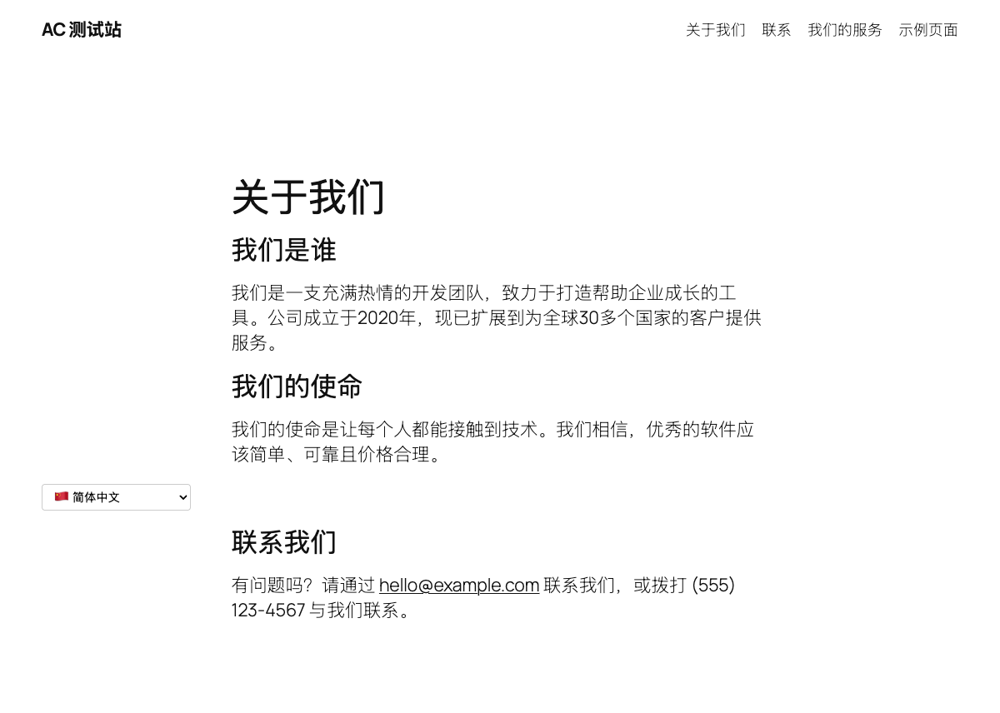

<p align="center">
  
</p>

<h1 align="center">Polyglot</h1>

<p align="center">
  AI-powered real-time translation for WordPress using OpenAI.<br>
  Translates pages and posts on the fly with URL-based language prefixes and smart caching.
</p>

---

## How It Works

1. **First visit** to a translated URL (e.g., `/es/about-us/`) triggers an OpenAI API call to translate the page content
2. **Translation is cached** in a custom database table
3. **Subsequent visits** serve the cached translation instantly
4. **When you update a post** in WordPress, the cache is automatically invalidated
5. **Next visit** after an update re-translates with the new content

No duplicate pages, no manual translations, no complex setup. Just add your API key, pick your languages, and go.

## Features

- **URL-based language routing** - Clean URLs like `/es/page-slug/`, `/fr/page-slug/`
- **OpenAI-powered translation** - Uses GPT-4o Mini (cheapest) or GPT-4o for high-quality, natural translations
- **Smart caching** - Translations stored in a custom DB table; auto-invalidated when content changes
- **Language switcher as nav menu item** - Add to any WordPress menu via Appearance > Menus; shows current language at top level with available languages as sub-items
- **Language switcher shortcode** - `[acwpt_switcher]` renders a dropdown with all enabled languages
- **Flag emoji toggle** - Show or hide flag emojis in the language switcher
- **Browser language detection** - Detects visitor's browser language and suggests switching via a dismissable banner
- **SEO-friendly** - Outputs `<link rel="alternate" hreflang="...">` tags, sets `<html lang="...">`, and generates a multilingual sitemap with hreflang annotations at `/acwpt-sitemap.xml`
- **33 languages supported** - English, Spanish, French, German, Italian, Portuguese, Chinese, Japanese, Korean, Arabic, Russian, Hindi, Dutch, Swedish, Turkish, Polish, Vietnamese, Thai, Indonesian, Ukrainian, Czech, Danish, Finnish, Greek, Hebrew, Hungarian, Norwegian, Romanian, Slovak, Bulgarian, Malay, Tamil, Bengali
- **Configurable source language** - Your site doesn't have to be in English
- **API usage tracking** - Monitor requests, tokens, and estimated cost from the admin panel
- **Cache management** - View stats and clear cache from the admin panel
- **Clean uninstall** - Removes all data (DB table + options) when deleted

## Screenshots

### Admin Settings

Configure your API key, model, source language, target languages, and display options all in one place.


### English (Source)

Your original content, with the language switcher dropdown showing all available translations.



### Spanish Translation

Full page translation including title, content, and navigation - all generated automatically by OpenAI.



### Chinese Translation

Even complex scripts are translated accurately with proper character rendering.



## Installation

1. Upload the `ac-wp-translator` folder to `/wp-content/plugins/`
2. Activate the plugin in WordPress admin
3. Go to **Settings > AC Translator**
4. Enter your OpenAI API key
5. Select which languages to enable
6. Add the language switcher to a nav menu or use `[acwpt_switcher]` shortcode

## Settings

| Setting | Description |
|---------|-------------|
| **OpenAI API Key** | Your OpenAI API key (get one at [platform.openai.com](https://platform.openai.com)) |
| **Model** | GPT-4o Mini (recommended, cheapest) or GPT-4o (higher quality) |
| **Source Language** | The language your content is written in (default: English) |
| **Target Languages** | Check the languages you want translations for |
| **Flag Emojis** | Show/hide flag emojis in the language switcher |
| **Language Suggestion** | Show/hide the browser language detection banner |

## URL Structure

Pages without a language prefix display in the **source language** (your default):

```
https://yoursite.com/about-us/          → English (source)
https://yoursite.com/es/about-us/       → Spanish
https://yoursite.com/fr/about-us/       → French
https://yoursite.com/zh/about-us/       → Chinese
```

## Language Switcher

### Nav Menu Item

1. Go to **Appearance > Menus** (the plugin registers a menu location so this is available even in block themes)
2. Find the **AC Language Switcher** panel on the left sidebar
3. Click **Add to Menu**
4. Position the item wherever you want in your menu
5. Save the menu

The top-level item dynamically shows the **current language** (e.g. "Spanish" when viewing `/es/`). Sub-items list all other available languages, each linking to the translated version of the current page. Respects the **Flag Emojis** setting.

In block themes (e.g. Twenty Twenty-Five), use the **Classic Menu** block in the Site Editor and select the menu containing the Language Switcher.

### Shortcode (Dropdown)

```
[acwpt_switcher]
```

Renders a `<select>` dropdown with all enabled languages. The current language is pre-selected. Selecting a language navigates to the translated version of the current page.

You can also use it in theme templates:

```php
<?php echo do_shortcode('[acwpt_switcher]'); ?>
```

## Multilingual Sitemap

The plugin automatically generates a sitemap at `/acwpt-sitemap.xml` that follows [Google's hreflang sitemap spec](https://developers.google.com/search/docs/specialty/international/localized-versions#sitemap). Each published post/page gets a `<url>` entry for every language version, with `<xhtml:link rel="alternate" hreflang="...">` annotations cross-referencing all versions.

- Automatically added to `robots.txt` for search engine discovery
- Cached for 1 hour; auto-invalidated when posts are updated or settings change
- Includes `x-default` pointing to the source language URL

## How Caching Works

- Translations are stored in a `{prefix}_acwpt_translations` table
- Cache key: `post_id` + `language_code`
- A content hash (`md5` of title + content + excerpt) tracks changes
- When a post is saved, all cached translations for that post are deleted
- On next visit, the translation is regenerated from OpenAI
- You can manually clear all cached translations from the admin panel

## Cost Estimate

Using GPT-4o Mini:
- ~$0.15 per 1M input tokens, ~$0.60 per 1M output tokens
- A typical page (~500 words) costs roughly **$0.001 - $0.003** to translate
- 100 pages x 5 languages = ~$1-2 total for initial translation
- Cached translations are free on subsequent visits

## Requirements

- WordPress 5.6+
- PHP 7.4+
- OpenAI API key
- Pretty permalinks enabled (Settings > Permalinks > anything except "Plain")

## Development

### Docker Setup

```bash
docker-compose up -d
```

This starts WordPress on port **8085** and MySQL on port **3310**. The plugin directory is mounted into the container.

- Site: http://localhost:8085
- Admin: http://localhost:8085/wp-admin/ (admin / admin)

### File Structure

```
ac-wp-translator/
├── ac-wp-translator.php          # Main plugin file, bootstrap
├── includes/
│   ├── class-acwpt-languages.php # Language definitions (33 languages)
│   ├── class-acwpt-cache.php     # Database table CRUD & usage tracking
│   ├── class-acwpt-translator.php # OpenAI API integration
│   ├── class-acwpt-admin.php     # Settings page & nav menu meta box
│   └── class-acwpt-frontend.php  # URL routing, content filters, shortcode, SEO, sitemap
├── assets/
│   ├── icon.svg                  # Plugin icon
│   ├── css/
│   │   ├── admin.css             # Admin settings styles
│   │   └── frontend.css          # Switcher & suggestion banner styles
│   ├── js/
│   │   ├── admin.js              # API key test & cache flush
│   │   └── detect.js             # Browser language detection
│   └── screenshots/              # README screenshots
├── uninstall.php                 # Cleanup on plugin deletion
├── docker-compose.yml            # Development environment
└── README.md
```

## License

GPL v2 or later
