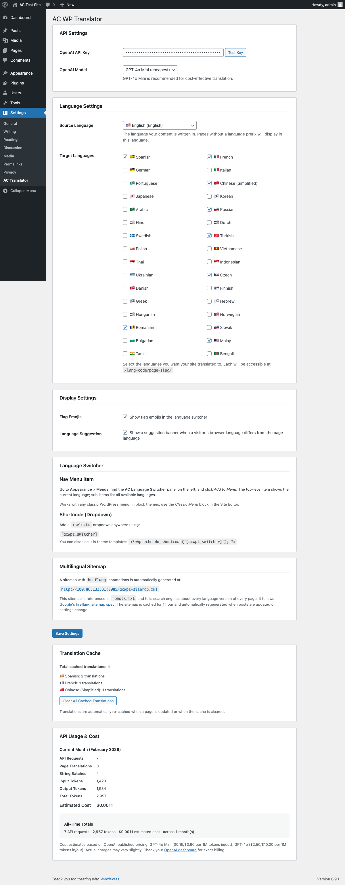

<p align="center">
  
</p>

<h1 align="center">amplifi.plugins</h1>

<p align="center">
  WordPress plugin suite by <a href="https://amplifi.studio">amplifi.studio</a><br>
  AI-powered tools that just work. Install one, discover the rest.
</p>

---

## Table of Contents

- [Plugins](#plugins)
  - [amplifi.translate](#amplifitranslate)
- [Installation](#installation)
- [Auto-Updates](#auto-updates)
- [Releases](#releases)
- [API Key Security](#api-key-security)
- [Development](#development)
- [License](#license)

## Plugins

All amplifi plugins appear under a single **amplifi.studio** menu in the WordPress admin sidebar. Install any plugin and use the **Plugin Hub** to discover and install others.

### amplifi.translate

AI-powered real-time translation for WordPress using OpenAI. Translates pages and posts on the fly with URL-based language prefixes (`/es/`, `/fr/`, `/zh/`, etc.) and smart database caching.

**Features:**
- URL-based language routing (`/es/page-slug/`, `/fr/page-slug/`)
- OpenAI-powered translation (any model - GPT-4o Mini recommended)
- Smart caching with auto-invalidation on content changes
- Language switcher as nav menu item or `[acwpt_switcher]` shortcode
- Browser language detection with suggestion banner
- SEO: hreflang tags, `<html lang>`, multilingual sitemap at `/acwpt-sitemap.xml`
- 33 languages supported
- API usage tracking with cost estimates

**Screenshots:**

| Admin Settings | English Source | Spanish | Chinese |
|:-:|:-:|:-:|:-:|
|  |  |  |  |

[Full documentation](plugins/ac-wp-translator/README.md)

## Installation

1. Download the latest plugin zip from [Releases](https://github.com/abchiaravalle/amplifi.plugins/releases/latest)
2. In WordPress admin, go to **Plugins > Add Plugin > Upload Plugin**
3. Upload the zip and activate
4. Find the plugin under the **amplifi.studio** sidebar menu

## Auto-Updates

All amplifi plugins support automatic updates from GitHub releases. When a new version is published, WordPress will show it in **Dashboard > Updates** just like any other plugin. No configuration needed.

## Releases

Releases are created with the included release script:

```bash
./scripts/release.sh 1.2.0                    # Release all plugins
./scripts/release.sh 1.2.0 ac-wp-translator   # Release specific plugin
```

This will:
1. Bundle each plugin into a production-ready zip (excluding dev files)
2. Generate a changelog from git history since the last release
3. Create a GitHub release with the zips attached
4. Tag the release for auto-update discovery

## API Key Security

Plugins that use external APIs (like OpenAI) require you to provide your own API key. **You are responsible for securing your keys:**

- **Scope your keys** - Use OpenAI's API key permissions to restrict access to only the endpoints the plugin needs (Chat Completions)
- **Set rate limits** - Configure spending limits and rate limits in your OpenAI dashboard to prevent unexpected charges
- **Set budget alerts** - Enable billing alerts at [platform.openai.com](https://platform.openai.com/settings/organization/billing/overview)
- **Rotate keys** - If you suspect a key has been compromised, rotate it immediately
- Keys are stored in your WordPress database (`wp_options`) and are never transmitted to any server other than OpenAI's API

## Development

```
amplifi.plugins/
├── plugins/
│   └── ac-wp-translator/          # amplifi.translate plugin
│       ├── ac-wp-translator.php   # Main plugin file
│       ├── includes/              # PHP classes
│       ├── assets/                # CSS, JS, screenshots, icon
│       ├── uninstall.php          # Clean uninstall
│       ├── docker-compose.yml     # Dev environment
│       └── README.md              # Plugin-specific docs
├── shared/
│   └── amplifi-framework.php      # Shared: admin menu, auto-updates, hub
├── scripts/
│   └── release.sh                 # Build & publish releases
├── LICENSE                        # MIT / Zero Warranty
├── CLAUDE.md                      # AI assistant context
└── README.md                      # This file
```

Each plugin has its own `docker-compose.yml` for local development:

```bash
cd plugins/ac-wp-translator
docker-compose up -d
# WordPress on :8085, MySQL on :3310
```

## License

MIT License - Zero Warranty. See [LICENSE](LICENSE) for the full text.

This software is provided "AS IS" without warranty of any kind. amplifi.studio makes no guarantees regarding quality, reliability, accuracy, or fitness for a particular purpose. Use at your own risk.
